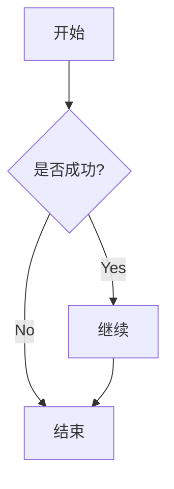
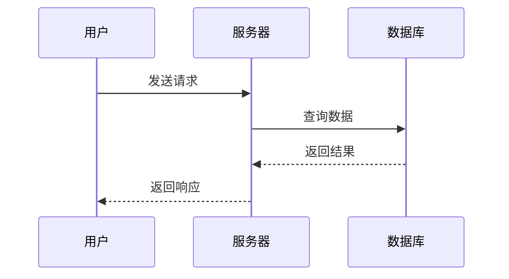
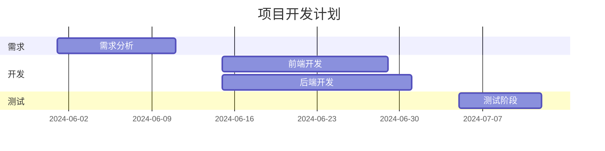
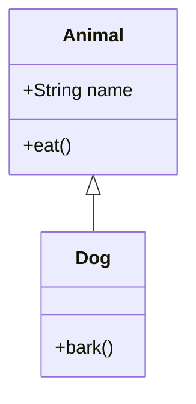
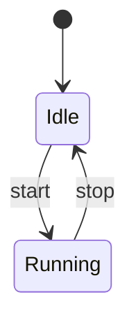
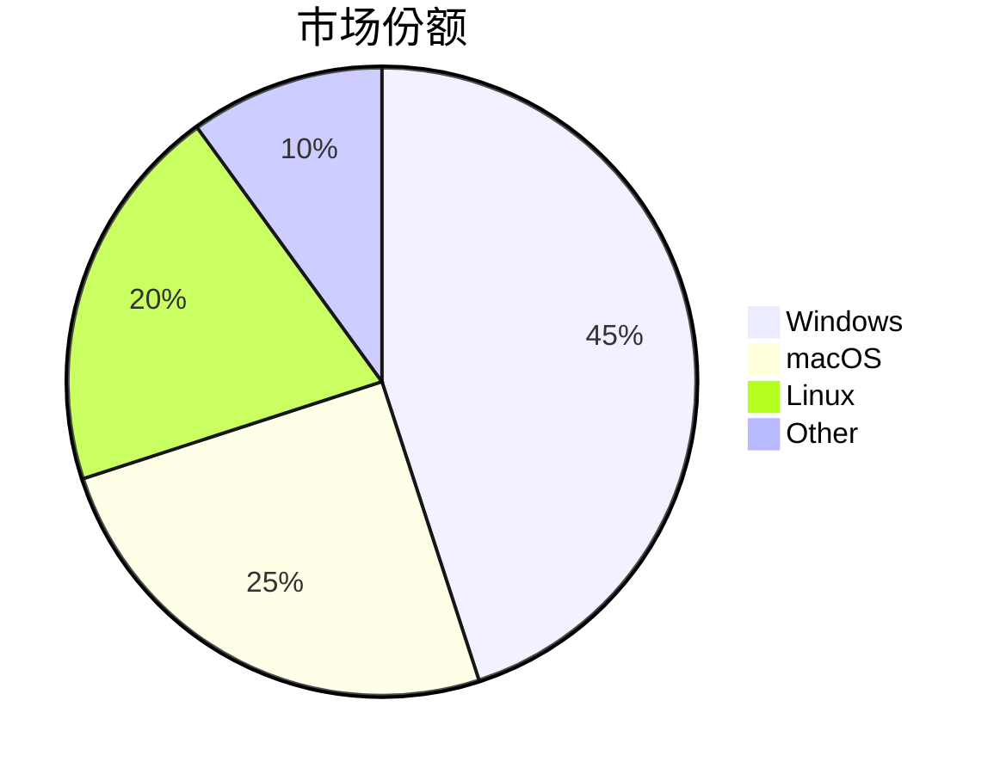

# Markdown 完全入门指南（含公式、Mermaid、表格、代码、脚注、HTML）

> 本文涵盖 Markdown 主流语法，适合从零学习与作为速查手册。

---

# 一、基础语法

## 1. 标题（Headings）

```markdown
# 一级标题

## 二级标题

### 三级标题

#### 四级标题

##### 五级标题

###### 六级标题
```

<fieldset style="border: 2px solid; border-radius: 8px; padding: 20px; ">
  <legend style="font-weight: bold; padding: 0 10px; font-size: 18px;">效果展示</legend>
  
# 一级标题
  
## 二级标题
  
### 三级标题
  
#### 四级标题
  
##### 五级标题
  
###### 六级标题
  
</fieldset>

---

## 2. 强调文本

`*斜体*` `_斜体_ `  
`**粗体**`  
`**_粗斜体_**`
`~~删除线~~`

<fieldset style="border: 2px solid; border-radius: 8px; padding: 20px; ">
  <legend style="font-weight: bold; padding: 0 10px; font-size: 18px;">效果展示
  </legend>
  
   *斜体*   
  
   _斜体_   
  
  **粗体**     
  
**_粗斜体_**
  
~~删除线~~
  
</fieldset>

---

## 3. 行内代码

使用 `printf()` 输出。

<fieldset style="border: 2px solid; border-radius: 8px;  padding: 20px;">
  <legend style="font-weight: bold; padding: 0 10px; font-size: 18px;">效果展示
  </legend>
  
```markdown
使用 `printf()` 输出。
```
</fieldset>

---

# 二、列表

## 1. 无序列表

```markdown
- 项目一
- 项目二
  - 子项目
- 项目三
```

<fieldset style="border: 2px solid; border-radius: 8px;  padding: 20px;">
  <legend style="font-weight: bold; padding: 0 10px; font-size: 18px;">效果展示
  </legend>
  
- 项目一
- 项目二
  - 子项目
- 项目三
  
</fieldset>

---

## 2. 有序列表

```markdown
1. 第一步
2. 第二步
   1. 子步骤 A
   2. 子步骤 B
3. 第三步
```

<fieldset style="border: 2px solid; border-radius: 8px;  padding: 20px;">
  <legend style="font-weight: bold; padding: 0 10px; font-size: 18px;">效果展示
  </legend>
  
1. 第一步
2. 第二步
   1. 子步骤 A
   2. 子步骤 B
3. 第三步 
  
</fieldset>

---

## 3. 任务列表（GFM）

```markdown
- [x] 已完成
	- [x] 已完成2
- [ ] 待办事项
```
<fieldset style="border: 2px solid; border-radius: 8px;  padding: 20px;">
  <legend style="font-weight: bold; padding: 0 10px; font-size: 18px;">效果展示
  </legend>
  
- [x] 已完成
  - [x] 已完成2
- [ ] 待办事项 
  
</fieldset>  


---

# 三、代码块

## 普通代码块

````markdown
```
sudo chmod u+x file.sh
```
````

## 语法高亮

````markdown
```js
function greet(name) {
  return `Hello, ${name}!`;
}
```

```python
print("Hello, Markdown!")
```

```xml
<root>
  <child>Content</child>
</root>
```
````

<fieldset style="border: 2px solid; border-radius: 8px; padding: 20px; margin: 20px;">
  <legend style="font-weight: bold; padding: 0 10px; font-size: 18px;">效果展示</legend>
  
```js
function greet(name) {
  return `Hello, ${name}!`;
}
```

```python
print("Hello, Markdown!")
```

```xml
<root>
  <child>Content</child>
</root>
```

</fieldset>

---

# 四、链接与图片

## 1. 链接

```markdown
[百度](https://www.baidu.com)

[百度][baidu]

[baidu]: https://www.baidu.com
```
<fieldset style="border: 2px solid; border-radius: 8px; padding: 20px; margin: 20px;">
  <legend style="font-weight: bold; padding: 0 10px; font-size: 18px;">效果展示</legend>
  
 [百度](https://www.baidu.com)

 [百度][baidu]

 [baidu]: https://www.baidu.com
  
</fieldset>  


## 2. 图片

```markdown


![示例图片][img]

[img]: ./assets/images/example.png
```

<fieldset style="border: 2px solid; border-radius: 8px; padding: 20px; margin: 20px;">
  <legend style="font-weight: bold; padding: 0 10px; font-size: 18px;">效果展示</legend>
  


![示例图片][img]

[img]: ./assets/images/example.png
  
</fieldset>  

## 3. 自动链接

```markdown
https://www.google.com
mailto:test@example.com
```
<fieldset style="border: 2px solid; border-radius: 8px; padding: 20px; margin: 20px;">
  <legend style="font-weight: bold; padding: 0 10px; font-size: 18px;">效果展示</legend>
  
https://www.google.com
  
mailto:test@example.com
  
</fieldset>    

---

# 五、表格

```markdown
| 姓名 | 年龄 | 城市 |
| ---- | ---- | ---- |
| 张三 | 25   | 北京 |
| 李四 | 30   | 上海 |
| 王五 | 22   | 深圳 |
```

<fieldset style="border: 2px solid; border-radius: 8px; padding: 20px; margin: 20px;">
  <legend style="font-weight: bold; padding: 0 10px; font-size: 18px;">效果展示</legend>
  
| 姓名 | 年龄 | 城市 |
| ---- | ---- | ---- |
| 张三 | 25   | 北京 |
| 李四 | 30   | 上海 |
| 王五 | 22   | 深圳 |
 
</fieldset>   

对齐：

```markdown
| 左对齐 | 居中 | 右对齐 |
| :----- | :--: | -----: |
| 文本   | 文本 |   文本 |
```

<fieldset style="border: 2px solid; border-radius: 8px; padding: 20px; margin: 20px;">
  <legend style="font-weight: bold; padding: 0 10px; font-size: 18px;">效果展示</legend>
  
| 左对齐 | 居中 | 右对齐 |
| :----- | :--: | -----: |
| 文本   | 文本 |   文本 |
 
</fieldset>   

---

# 六、分割线

```markdown
---
---
---
```
<fieldset style="border: 2px solid; border-radius: 8px; padding: 20px; margin: 20px;">
  <legend style="font-weight: bold; padding: 0 10px; font-size: 18px;">效果展示</legend>
  
---

---

---
 
</fieldset>   


---

# 七、数学公式（LaTeX）

> 需 MathJax / KaTeX 支持

## 行内公式

```markdown
勾股定理：$a^2 + b^2 = c^2$
```
<fieldset style="border: 2px solid; border-radius: 8px; padding: 20px; margin: 20px;">
  <legend style="font-weight: bold; padding: 0 10px; font-size: 18px;">效果展示</legend>
  
勾股定理：$a^2 + b^2 = c^2$
  
</fieldset>   


## 块级公式

```markdown
$$
\nabla \times \vec{E} = -\frac{\partial \vec{B}}{\partial t}
$$
```

<fieldset style="border: 2px solid; border-radius: 8px; padding: 20px; margin: 20px;">
  <legend style="font-weight: bold; padding: 0 10px; font-size: 18px;">效果展示</legend>
  
$$
\nabla \times \vec{E} = -\frac{\partial \vec{B}}{\partial t}
$$
  
</fieldset>   


---

# 八、Mermaid 图表

> 需平台支持 Mermaid（GitHub / Obsidian / Typora 等）

## 1. 流程图
```markdown



<fieldset style="border: 2px solid; border-radius: 8px; padding: 20px; margin: 20px;">
  <legend style="font-weight: bold; padding: 0 10px; font-size: 18px;">效果展示</legend>
  

  
</fieldset> 

## 2. 时序图
```markdown


<fieldset style="border: 2px solid; border-radius: 8px; padding: 20px; margin: 20px;">
  <legend style="font-weight: bold; padding: 0 10px; font-size: 18px;">效果展示</legend>
  

  
</fieldset> 

## 3. 甘特图
```markdown


<fieldset style="border: 2px solid; border-radius: 8px; padding: 20px; margin: 20px;">
  <legend style="font-weight: bold; padding: 0 10px; font-size: 18px;">效果展示</legend>
  

  
</fieldset> 

## 4. 类图
```markdown


<fieldset style="border: 2px solid; border-radius: 8px; padding: 20px; margin: 20px;">
  <legend style="font-weight: bold; padding: 0 10px; font-size: 18px;">效果展示</legend>
  

  
</fieldset> 

## 5. 状态图
```markdown

  
<fieldset style="border: 2px solid; border-radius: 8px; padding: 20px; margin: 20px;">
  <legend style="font-weight: bold; padding: 0 10px; font-size: 18px;">效果展示</legend>
  

  
</fieldset> 

## 6. 饼图
```markdown

<fieldset style="border: 2px solid; border-radius: 8px; padding: 20px; margin: 20px;">
  <legend style="font-weight: bold; padding: 0 10px; font-size: 18px;">效果展示</legend>
  

  
</fieldset> 
  
---

# 九、脚注（Footnotes）

```markdown
这是一个脚注示例[^1]。

[^1]: 这是脚注内容。
```
  
<fieldset style="border: 2px solid; border-radius: 8px; padding: 20px; margin: 20px;">
  <legend style="font-weight: bold; padding: 0 10px; font-size: 18px;">效果展示</legend>
  
这是一个脚注示例[^1]。

[^1]: 这是脚注内容。
  
</fieldset>   

---

# 十、HTML 混用

## 1. 基础 HTML

```html
<span style="color:red;">红色文字</span>

<div style="background:#f0f0f0;padding:10px;border-radius:6px;">
带背景的内容
</div>
```
  
<fieldset style="border: 2px solid; border-radius: 8px; padding: 20px; margin: 20px;">
  <legend style="font-weight: bold; padding: 0 10px; font-size: 18px;">效果展示</legend>
  
<span style="color:red;">红色文字</span>

<div style="background:gray;padding:10px;border-radius:6px;">
带背景的内容
</div>
  
</fieldset>     

## 2. 复杂表格

```html
<table style="border: 1px solid; border-collapse: collapse; width: 100%;">
  <tr>
    <th style="border: 1px solid; padding: 8px; text-align: left;">姓名</th>
    <th style="border: 1px solid; padding: 8px; text-align: left;">年龄</th>
  </tr>
  <tr>
    <td style="border: 1px solid; padding: 8px;">张三</td>
    <td style="border: 1px solid; padding: 8px;">25</td>
  </tr>
</table>
```
  

  
<fieldset style="border: 2px solid; border-radius: 8px; padding: 20px; margin: 20px;">
  <legend style="font-weight: bold; padding: 0 10px; font-size: 18px;">效果展示</legend>
  
<table style="border: 1px solid; border-collapse: collapse; width: 100%;">
  <tr>
    <th style="border: 1px solid; padding: 8px; text-align: left;">姓名</th>
    <th style="border: 1px solid; padding: 8px; text-align: left;">年龄</th>
  </tr>
  <tr>
    <td style="border: 1px solid; padding: 8px;">张三</td>
    <td style="border: 1px solid; padding: 8px;">25</td>
  </tr>
</table>
  
</fieldset>       


---

# 十一、转义字符

使用 `\` 进行转义：

```markdown
\*不是斜体\*
\# 不是标题
\> 不是引用
```
<fieldset style="border: 2px solid; border-radius: 8px; padding: 20px; margin: 20px;">
  <legend style="font-weight: bold; padding: 0 10px; font-size: 18px;">效果展示</legend>
  
\*不是斜体\*
\# 不是标题
\> 不是引用
  
</fieldset>     

---

# 十二、常见特殊符号

直接支持 Unicode：

例如：© ® ™ ✓ ✗ → ← ↑ ↓ € £ ¥ ∑ ∞ ≠ ≤ ≥等

---

# 十三、最佳实践

- 使用 4 空格缩进
- 不混用 Tab
- 图片使用相对路径
- Mermaid 保持统一缩进
- 脚注使用语义命名
- 长文档添加目录
- 公式使用 `$$` 块级形式

---
